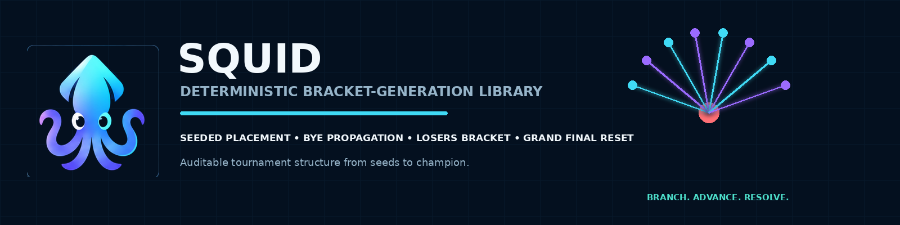
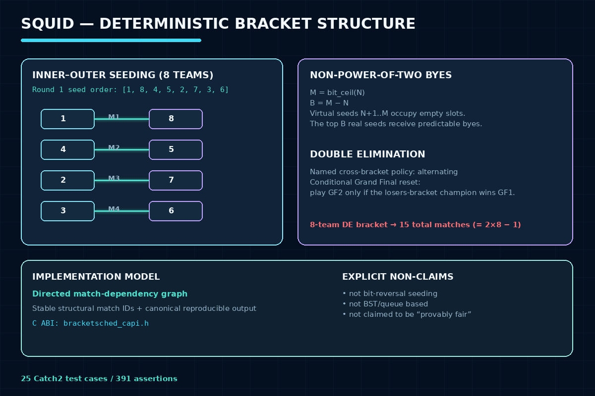

# bracketsched — Deterministic Bracket-Generation Library




## Course Information

| Field | Details |
|---|---|
| Course | Data Structures (CS216) |
| Semester | Semester 3 — Fall 2024 |
| University | Air University, Islamabad |
| Students | Syed Jazib Ali Rizvi (232145), Hussain Ali (232095), Muhammad Abdullah Haroon (232992) |

The three original implementations (a C++/CLI + WinForms app, a
header-only class library, and a native-DLL + C# frontend architecture)
are preserved unmodified under
[`archive/academic-original/`](archive/academic-original/).

## Overview

**bracketsched** is a small, native C++ library for deterministic
single- and double-elimination bracket generation, with a stable C ABI
for embedding into other languages/tools — not another Challonge-style
end-user app (that market is already well served). It replaces the
original's fixed 16-team, BST/queue-based implementation with:

- Any team count ≥ 2, with mathematically correct top-seed byes for
  non-power-of-two counts.
- The real, citable **inner-outer** ("recursive reflection") seeding
  algorithm — not bit-reversal, which produces a different and
  pedagogically wrong sequence (a mistake this project's research pass
  specifically caught before any code was written).
- Double elimination with a named, documented cross-bracketing policy
  (**alternating**) and Grand Final reset semantics — because, per the
  research this was built against, there is no single universal
  loser-drop algorithm across real tournament operators, so a library
  that hides this as an unspecified implementation detail would be
  making an unstated design decision on the caller's behalf.
- Deterministic, byte-identical canonical JSON output for the same input.
- A stable, boring C ABI (`capi/bracketsched_capi.h`) suitable for FFI
  from any language.

## Problem Statement

Apply real data-structure and algorithm design to a genuinely reusable
problem: generating a correct, fair, and reproducible tournament bracket
for an arbitrary number of entrants — not a fixed 16-team classroom demo.

## Design decisions

**Why not "provably fair"?** Tournament-seeding fairness has multiple
competing formal definitions in the literature (envy-freeness,
order-preservation, etc.), and balanced knockout brackets provably cannot
satisfy all of them simultaneously (Vu & Shoham, 2011). This library
therefore documents specific, checkable invariants instead of an
unfalsifiable fairness claim:

```text
- seed 1 and seed 2 cannot meet before the final
- the top 2^r seeds occupy 2^r structurally distinct regions of the draw, for every r
- every first-round pair (that isn't a bye) sums to bracket_size + 1
- the top (bracket_size - N) seeds receive the round-one byes, and no
  round-one pairing is ever bye-vs-bye (for N > 1)
```

All four are property-tested in [`tests/`](tests/) across a range of team counts.

**Why "inner-outer" seeding, named explicitly?** This is the real
construction used by production bracket-generation tools (see
`include/bracketsched/seeding.hpp` for the exact recursive definition and
citation) — not an invented permutation, and specifically not bit-reversal
(the two produce different sequences; an early version of this project's
research pass initially conflated them before verifying against the
actual algorithm).

**Why byes need no separate algorithm.** Padding the field to the next
power of two with "virtual" seeds numbered `N+1..bracketSize` and running
the *same* inner-outer seeding over all of them automatically routes byes
to exactly the top `bracketSize - N` real seeds — a direct consequence of
the seeding algorithm's `a + b = bracketSize + 1` pairing invariant. No
separate bye-placement logic exists in this codebase.

**Why the losers bracket isn't "BST + Queue" and isn't hardcoded to 16
teams.** A tournament bracket is fundamentally a directed dependency
graph (a match's slot is sourced from a participant, another match's
winner, another match's loser, or a bye) — a binary search tree gives no
advantage once entrants already have unique seeds, and hardcoding 4
rounds only works for exactly 16 teams. The production model here is
`BracketGraph` (`include/bracketsched/types.hpp`): an immutable list of
`Match` records with typed slot sources, generated once and never mutated.

**A real bug this design caught:** the first version of the losers
-bracket builder assumed each wave of winners-bracket losers is always
the same size as the current losers-bracket population — true only when
there are no byes. With byes present, a winners-bracket round can produce
*fewer* real losers than its match count (a bye-decided pairing has no
loser at all), and the original code simply dropped those positions
instead of letting them keep propagating as empty slots, silently losing
a match for any non-power-of-two team count under double elimination.
Fixed by making `Source` a true three-way type (`Participant` / `Bye` /
`MatchRef`) and routing every pairing — winners rounds, losers self-pairs,
injections, and consolidations alike — through one shared bye-aware
`resolvePair` function. See `PROJECT_NOTES.md` for the full story and the
regression test that locks it in.

**Why the Grand Final "reset" match has the same source slots as the
first Grand Final, not "winner of GF1".** This library only generates
*structure*, not live results — it doesn't know who wins. Under
`GrandFinalPolicy::ResetIfNecessary`, the second Grand Final match is
conditional (`Match::conditional == true`) and re-plays the *same two
entrants* as the first — it is only actually contested if the
lower-bracket entrant wins game one, per real double-elimination rules
(e.g. Start.gg's tournament rules), not a mathematically different event.

**Why a JSON-only C ABI, not a fully typed struct ABI.** A typed struct
ABI (participant arrays, match arrays, opaque handles with getters) is
more ergonomic for a serious native integration, but is meaningfully more
marshaling code and a larger surface to get wrong across languages. v1
ships `bracketsched_generate_json` / `bracketsched_string_free` /
`bracketsched_last_error` — three functions, no STL types or exceptions
crossing the boundary, genuinely embeddable from any language with C FFI
today (verified — see "Testing" below). A fully typed ABI is listed under
Future Enhancements, not implemented as a partial/untested stand-in.

## Tools and Technologies

- C++20, CMake, MinGW g++ (same toolchain as the other C++ projects in
  this workspace)
- [nlohmann/json](https://github.com/nlohmann/json) for canonical JSON
- [Catch2 v3](https://github.com/catchorg/Catch2) for the test suite

## Features

- `generateBracket(participants, config)` — the entire public C++ API surface.
- Single and double elimination, arbitrary team count ≥ 2.
- Inner-outer seeding with automatic top-seed byes.
- Double elimination: alternating cross-bracketing, configurable Grand
  Final policy (`ResetIfNecessary` / `SingleMatch`).
- Deterministic structural match IDs (`WB-R1-M1`, `LB-R2-M1`, `GF-R1-M1`, ...).
- Canonical, byte-identical-for-identical-input JSON serialization.
- A stable C ABI (`bracketsched_capi.h`) built as a real shared library
  (`libbracketsched_capi.dll`) — verified by compiling and running an
  independent consumer program against it, not just built and assumed.
- A thin CLI (`bracket generate teams.json`) demonstrating the library.
- 25 Catch2 test cases / 391 assertions covering seeding, byes, seed
  -separation invariants, exact double-elimination round structure (hand
  -verified against the research's worked 8-team example), Grand Final
  conditional semantics, and a permanent regression test for the
  bye-propagation bug described above.

## How It Works



## Repository Structure

```text
competition-scheduler-cpp/
  README.md, PROJECT_NOTES.md, CHANGELOG.md
  CMakeLists.txt, build.sh
  include/bracketsched/   types, seeding, generator, serialize
  capi/bracketsched_capi.h
  src/                    implementations + main.cpp (CLI) + capi.cpp
  tests/                  25 Catch2 test cases
  examples/eight-teams.json
  archive/academic-original/   all three original implementations, untouched
  shared-data/, docs/, output/   original coursework artifacts
  project.yaml
```

## Building from source

Requires CMake, MinGW g++, and the vcpkg instance already set up for the
sibling C++ projects in this workspace:

```bash
./build.sh
```

Produces `build/bracket.exe`, `build/libbracketsched_capi.dll`, and
`build/bracketsched_tests.exe`.

## Usage

### CLI

```bash
bracket generate teams.json [--format single|double] [--grand-final reset|single]
```

`teams.json`: `{"participants": [{"seed": 1, "name": "Alpha"}, ...], "format": "double", "grand_final": "reset"}`.

### C ABI

```c
#include "bracketsched_capi.h"

char* json = NULL;
if (bracketsched_generate_json(requestJson, &json) == 0) {
    /* use json */
    bracketsched_string_free(json);
} else {
    fprintf(stderr, "%s\n", bracketsched_last_error());
}
```

### Worked example (real, captured output)

8 teams, double elimination, `examples/eight-teams.json`. Round 1 exactly
matches the inner-outer sequence `[1,8,4,5,2,7,3,6]`:

```json
{"id": "WB-R1-M1", "first": {"seed": 1}, "second": {"seed": 8}}
{"id": "WB-R1-M2", "first": {"seed": 4}, "second": {"seed": 5}}
{"id": "WB-R1-M3", "first": {"seed": 2}, "second": {"seed": 7}}
{"id": "WB-R1-M4", "first": {"seed": 3}, "second": {"seed": 6}}
```

The losers bracket (real, captured output) matches the hand-derived
structure exactly:

```text
LB-R1-M1: loser(WB-R1-M1) vs loser(WB-R1-M2)
LB-R1-M2: loser(WB-R1-M3) vs loser(WB-R1-M4)
LB-R2-M1: winner(LB-R1-M1) vs loser(WB-R2-M1)
LB-R2-M2: winner(LB-R1-M2) vs loser(WB-R2-M2)
LB-R3-M1: winner(LB-R2-M1) vs winner(LB-R2-M2)
LB-R4-M1: winner(LB-R3-M1) vs loser(WB-R3-M1)
GF-R1-M1: winner(WB-R3-M1) vs winner(LB-R4-M1)
GF-R2-M1: winner(WB-R3-M1) vs winner(LB-R4-M1)   (conditional: only if the LB side wins GF1)
```

15 total matches = `2×8 − 1` (the reset-inclusive invariant).

## How to Review

1. Start with this README, then read
   [`src/generator.cpp`](src/generator.cpp) (the whole library) alongside
   [`include/bracketsched/seeding.hpp`](include/bracketsched/seeding.hpp).
2. Run `./build.sh` then `./build/bracketsched_tests.exe` — 25 test cases,
   all passing.
3. Run the worked example above and compare against the structure quoted here.
4. Compare against `archive/academic-original/` for the three original variants.

## Testing

```text
$ ./build/bracketsched_tests.exe
All tests passed (391 assertions in 25 test cases)
```

Also independently verified: compiled a small external C++ program
against `libbracketsched_capi.dll` (dynamic linking, separate compilation
unit) and confirmed it receives correct, valid canonical JSON back through
the C ABI — the "embeddable" claim is checked, not assumed.

## Original Results (academic artifact)

The 16-team fixed bracket from all three original implementations is
reproduced exactly by `generateBracket` with 16 participants and
`Format::Single` (15 matches, `N-1`). See `archive/academic-original/`
for the original BST/queue-based code and `docs/Report.docx` for the
original writeup.

## Limitations

- **Ranked/seeded input only** — participants must already have unique
  seeds 1..N. Unseeded random-draw bracket generation is deferred (see
  Future Enhancements); it needs a separately-specified PRNG and shuffle
  algorithm to keep the determinism contract meaningful, which the
  research this was built against explicitly cautioned against
  under-specifying (`std::shuffle`'s exact output isn't portable across
  standard library implementations).
- **JSON-only C ABI** — no fully typed struct ABI yet (see "Design decisions").
- **Alternating cross-bracket policy only** — NCAA- and IJF-style
  policies (real, named alternatives per the research) are not implemented.
- **No differential testing against another bracket-generation library**
  (e.g. `brackets-manager.js`) has been performed yet — the correctness
  evidence here is the property/invariant test suite, not a cross
  -implementation comparison.
- **No CI pipeline has run against this code** — not pushed to GitHub in
  this task.

## Future Enhancements

- A fully typed struct C ABI alongside the JSON one, for zero-copy
  integrations that need it.
- Unseeded random-draw mode with an explicitly specified PRNG (e.g. PCG32)
  and Fisher-Yates shuffle, so a given random seed has a portable,
  documented result.
- NCAA/IJF cross-bracketing policy variants.
- Differential testing against `brackets-manager.js` output for
  overlapping bracket sizes.
- Round-robin and group-stage formats (explicitly out of scope for v1).

## Safety and Privacy

- No real secrets, credentials, or private keys are included.
- No private user data is included. `shared-data/Teams.txt` mixes
  classmates' first names into fictional bracket data from the original
  coursework submission — left as-is per this workspace's established
  policy for group-project attribution (low-severity: first names only,
  not presented as real personal records).

## Ethical Notice

This project performs only in-memory bracket-structure generation — no
network access, no real player data beyond first names already present in
the original coursework submission. Intended for learning and for
embedding in other tools.
